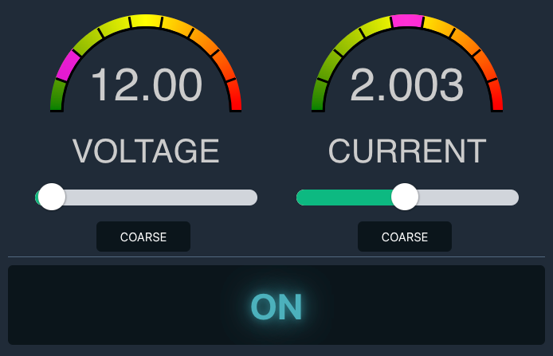

## Hantek Station - Bench Power Supply Control




### Development

Prerequisites

- docker
- docker-compose

Run

```bash
docker compose -f compose.dev.yml up -d --build
```

UI will run on http://localhost:5173 
API runs on http://localhost:8000


TODO:

- [x] Display active voltage/current
- [x] Fetch voltage/current periodically
- [x] Set initial voltage/current
- [x] Display set voltage/current when dragging sliders
- [x] Reconnect WS on connection loss
- [ ] Display error messages